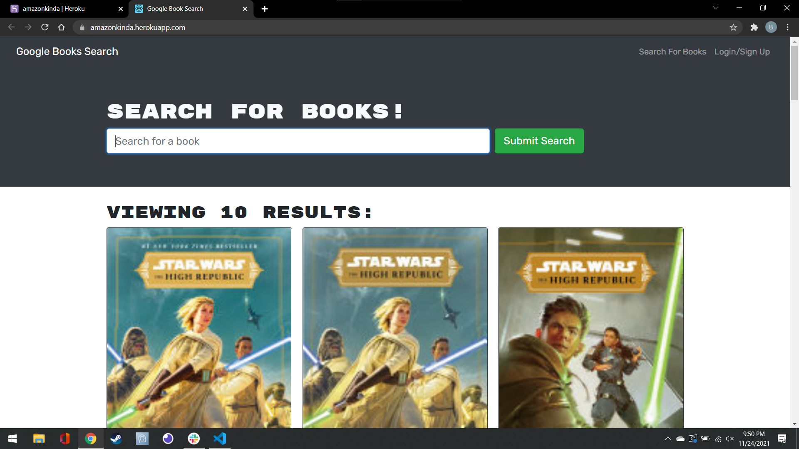

# AmazonKinda

## Table of Contents
* [Description](#description)
* [Installation](#installation)
* [Usage](#usage)
  * [License](#license) 
* [Contributing](#contributing)
* [Tests](#tests)
* [Questions](#questions)

----

## Description
This project is part of the GTPE Coding Bootcamp to convert a book search engine from RESTful to MERN

----

## Installation
No installation needed for this project.

----

## Usage
To use this app, follow the link provided to the live project.

browse products and add them to your cart

[Go To Live Project](https://amazonkinda.herokuapp.com/)

[Project Repo](https://github.com/BerlicTheHunter/AmazonKinda)

## License
This project is licensed under MIT License and can be found [here](./LICENSE)

----

## Contributing
This project is not accepting contributions at this time

----

## Tests
None provided

----

## Questions
For any other questions, please the the provided links below
* [Github](https://github.com/BerlicTheHunter)
* [Email](mailto:bsorrell3@gmail.com)
